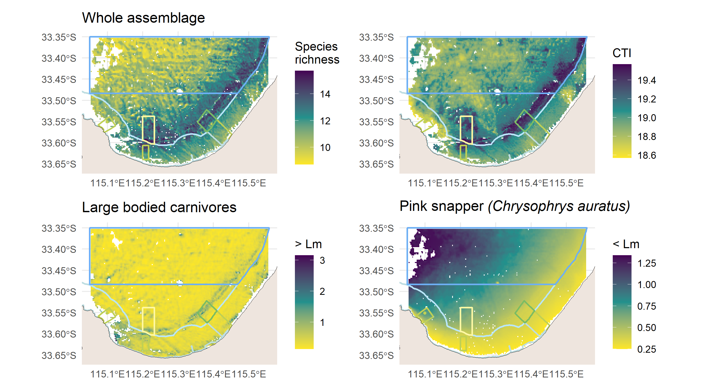

# Fish modelling

## Spatial predictions

{#fig-spatialpreds fig-align="center"}

Spatial patterns in the distribution of key fish metrics for the Geographe Marine Park highlight increased species richness along reef features that run through the National Park and Habitat Protection Zones (@fig-spatialpreds).

## Temporal predictions
