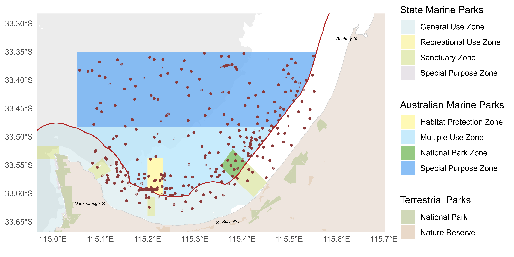

# Existing knowledge

## Background

## Features and values of the Geographe Marine Park

{#fig-location alt="Study area of the Geographe Marine Park showing the State and Commonwealth (Australian Marine Park) managed marine park zones. The red line following the coast demarcates the border of state and commonwealth waters. Bathymetric contours shown are 30, 70, 200 & 700 m, which denote historical sea levels and ecosystem depth contours."}

{#fig-kef alt="Key Ecological Features at the scale of the Geographe Marine Park. Excerpt from Marine Key Ecological Features of the Australian Marine Parks. Legend for Australian Marine Parks, Terrestrial Managed Areas and State Marine Parks can be found in Figure 1. The red line delimits state and commonwealth waters. Geographe Bay = Commonwealth marine environment within and adjacent to Geographe Bay, Ancient coastline = Ancient coastline at 90-120m depth."}

{#fig-sealevels alt="Old coastline features of the Geographe Marine Park. The dashed line represents the location of Figure X"}

## Pressures

# Latest survey aims, design and methods

## Aims and objectives

## Discovery questions: interaction of environmental values and pressures, rationale for future surveys and monitoring

## Survey design

## Survey stages

{#fig-sites}

# Latest results and discussion

## Bathymetry and relief

### Bathymetry and significant seafloor features

{#fig-cross alt="Transect across significant seafloor and submerged coastal features across the Ngari Capes Marine Park and GMP. Submerged coastlines from thousands of years before present (Ka BP) are indicated. The red line delimits State and Commonwealth waters. The green and pale blue line delimits the National Park Zone and GMP limit respectively. Distances from the coast are measured in km. The location of this transect is given in Figure X."}

## Benthic biota and habitat extent

### Distribution of dominant habitat classes

### Broader study area - habitat extent

### Characterization of significant seafloor features

## Fish assemblage

### Broader study area

![Spatial predictions for whole assemblage and large-bodied carnivorous assemblage metrics across the broader study area. Individual heat maps represent species richness per deployment, Community Thermal Index (CTI) per deployment, the abundance of greater than size of maturity large bodied carnivorous species per deployment (\> Lm) and the abundance of smaller than size of maturity Pink snapper (*Chrysophrys auratus*) per deployment (\< Lm). State and Commonwealth marine park boundaries are shown.](images/GeographeAMP_fish-individual_predictions.png){#fig-spatialpreds fig-align="center"}

Spatial patterns in the distribution of key fish metrics for the Geographe Marine Park highlight increased species richness along reef features that run through the National Park and Habitat Protection Zones (@fig-spatialpreds).

{#fig-temppreds}

Temporal trends of key fish metrics for the Geographe Marine Park highlight increased abundance of mature large bodied carnivorous species in the National Park Zone (@fig-temppreds).

### Threatened species

# General conclusions and recommendations for future work

## General conclusions

## Recommendations for benchmarks and monitoring

## Guidance for future studies and surveys

# References
