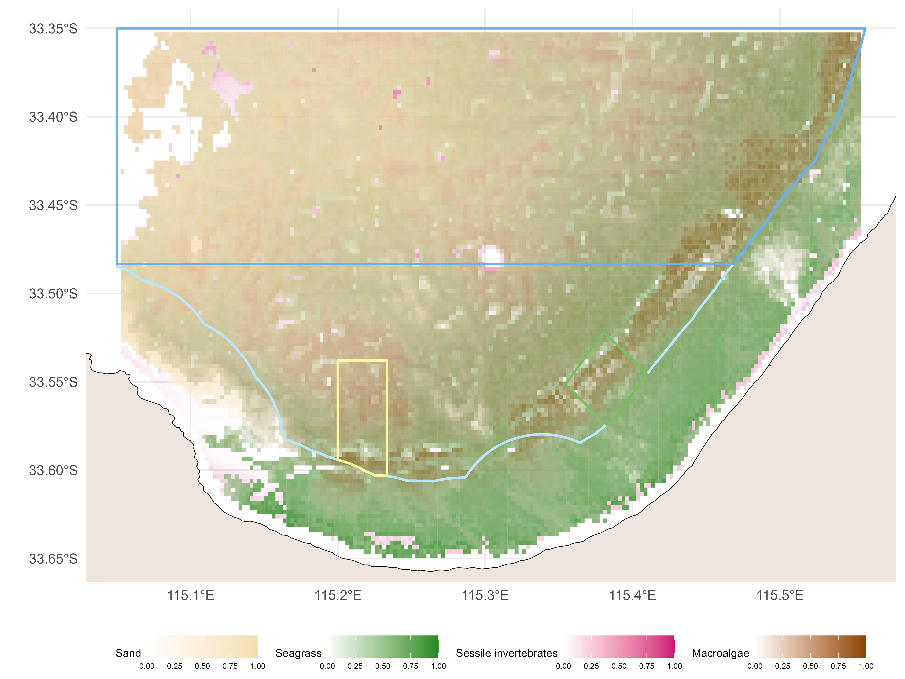
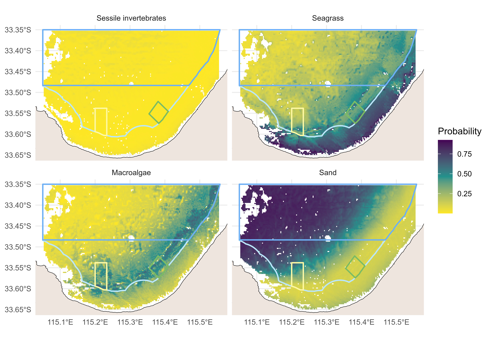

```{r}
#| echo: false
marine_park <- "Geographe Marine Park"
```

# Existing knowledge

## Background

## Features and values of the `{r} marine_park`

{#fig-location}

{#fig-kef}

{#fig-sealevels}

| Key Ecological Features | Description |
|-------------------------|-------------|
|                         |             |
|                         |             |
|                         |             |
|                         |             |
|                         |             |
|                         |             |
|                         |             |
|                         |             |

: Key Ecological Features of the `{r} marine_park`. Environmental features summarised from the South-west Marine Parks Network Management Plan (Director of National Parks 2018). {#tbl-kef}

| Key natural values |
|--------------------|
|                    |
|                    |
|                    |
|                    |
|                    |

: Draft\^ Key Natural Values of the `{r} marine_park`. Key natural values summarised from the South-west Marine Parks Network Management Plan (Director of National Parks 2018). \* Values characterised within the latest survey (Section 3 and 4). \^ These may be revised during Parks Australia's ongoing development of a Monitoring, Evaluation, Improvement and Reporting framework. {#tbl-knv}

| Cultural value | Description |
|----------------|-------------|
|                |             |
|                |             |
|                |             |
|                |             |
|                |             |
|                |             |
|                |             |
|                |             |

: Cultural values\* of the `{r} marine_park` for the Wadandi region. \*Reproduced from Davies et al. (2022) ‘The Cultural Seascape of Wadandi Boodja’. {#tbl-cultural}

| Key social and economic values |
|--------------------------------|
|                                |
|                                |
|                                |
|                                |
|                                |
|                                |
|                                |

: Draft\* social, economic and use values of the `{r} marine_park`. Key social and economic values summarised from the South-west Marine Parks Network Management Plan (Director of National Parks 2018). \* These values may be revised during Parks Australia's ongoing development of a Monitoring, Evaluation, Improvement and Reporting framework. {#tbl-socio}

## Pressures

| Key pressures |
|---------------|
|               |
|               |
|               |
|               |
|               |
|               |
|               |

: Draft\* key pressures in the `{r} marine_park`. Key pressures likely to be acting on natural values and ecosystem components of the South-west Corner Marine Park. Key pressures are summarised from the South-west Marine Parks Network Management Plan (Director of National Parks 2018). \* These pressures may be revised during Parks Australia's ongoing development of a Monitoring, Evaluation, Improvement and Reporting framework. {#tbl-pressures}

Fig - Practice = National RUM of recreational fishing

| Climatology, oceanography and climate change metrics | Description                                                                                                                                                            | Reference or source |
|-------------------|----------------------------------|-------------------|
| Ocean acidity                                        | Modelled product of ocean acidity, providing an indication of physiological stress for marine biota and for calcifying organisms in particular @Orr2005-hh.            | AODN\*              |
| Sea level anomaly                                    | Satellite derived observation providing a proxy of upwelling and potential indicating areas of increased nutrient exchange and productivity (Pearce et al. 2009) .     | AODN\*              |
| Sea surface temperature                              | Satellite derived observation providing a measurement of sea surface temperature and potential indicator of physiological stress for marine biota @Caputi2009-qj.      | AODN\*              |
| Degree Heating Weeks                                 | Designed to provide an indicator of potential bleaching in tropical coral reefs, this product can also be used to characterise marine heat waves globally @Liu2014-dt. | NOAA                |

: Potential metrics of climatology, oceanography and climate change. Examples included are indexes of ocean acidity, sea level anomaly, sea surface temperature and degree heating weeks (Figure 8 - 11). These metrics may be revised during Parks Australia's ongoing development of a Monitoring, Evaluation, Improvement and Reporting framework. Where indicated, \*data was sourced from Australia’s Integrated Marine Observing System (IMOS) – IMOS is enabled by the National Collaborative Research Infrastructure strategy (NCRIS). {#tbl-climmetrics}

Fig - Ocean Acidity/temporal patterns in SLA, SST & DHW

Fig - Sea Level Anomaly spatial

Fig - Sea Surface Temperature spatial

Fig - Degree Heating Weeks spatial (2 timepoints referenced from temporal patterns)

# Latest survey aims, design and methods

## Aims and objectives

## Discovery questions: interaction of environmental values and pressures, rationale for future surveys and monitoring

## Survey design

## Survey stages

{#fig-sites}

# Latest results and discussion

## Key socio-economic Values

### Knowledge

Fig - Awareness of the AMP

### Attitudes

Fig - support the AMP

### Practice

#### Extractive

Figure - spatial fishing use of the Geographe Marine Park

#### Non-extractive

Figure - spatial non-fishing use of the Geographe Marine Park

## Bathymetry and relief

### Bathymetry and significant seafloor features

{#fig-cross}

## Benthic biota and habitat extent

### Distribution of dominant habitat classes



### Distribution of individual habitat classes



### Distribution of sessile invertebrates by size class

### Distribution of Submerged Aquatic Vegetation

## Demersal fish assemblage

![Spatial predictions for whole assemblage and large-bodied carnivorous assemblage metrics across the broader study area. Individual heat maps represent species richness per deployment, Community Thermal Index (CTI) per deployment, the abundance of greater than size of maturity large bodied carnivorous species per deployment (\> Lm) and the abundance of smaller than size of maturity Pink snapper (*Chrysophrys auratus*) per deployment (\< Lm). State and Commonwealth marine park boundaries are shown.](images/GeographeAMP_fish-individual_predictions.png){#fig-spatialpreds fig-align="center"}

Spatial patterns in the distribution of key fish metrics for the `{r} marine_park` highlight increased species richness along reef features that run through the National Park and Habitat Protection Zones (@fig-spatialpreds).

{#fig-temppreds}

Temporal trends of key fish metrics for the `{r} marine_park` highlight increased abundance of mature large bodied carnivorous species in the National Park Zone (@fig-temppreds).

### Threatened species

## Mobile macro-invertebrates

ADD FIGURE - Spatial distribution by \> Lm and \< Lm - lobster and scallop?

ADD FIGURE - Temporal change by \> Lm and \< Lm - lobster and scallop?

# General conclusions and recommendations for future work

## General conclusions

## Recommendations for benchmarks and monitoring

## Guidance for future studies and surveys

# References
